# FriendShell

## Web Application with open source code 

### Description:
#### Web Application where you can openly or anonymously ask anyone about what interests you very much.

- ReactJS+Redux
- ExpressJS
- Mongoose
- JWT-Auth
- 'styled.components'

### Sample usage screenshots:

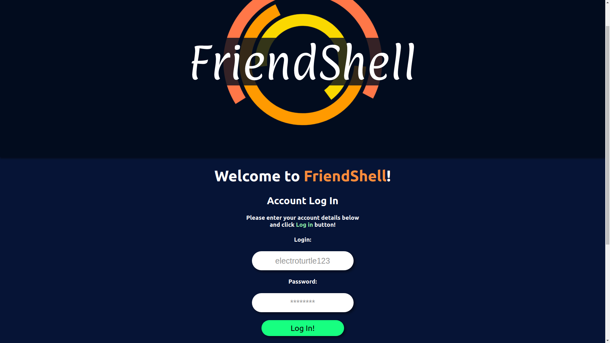
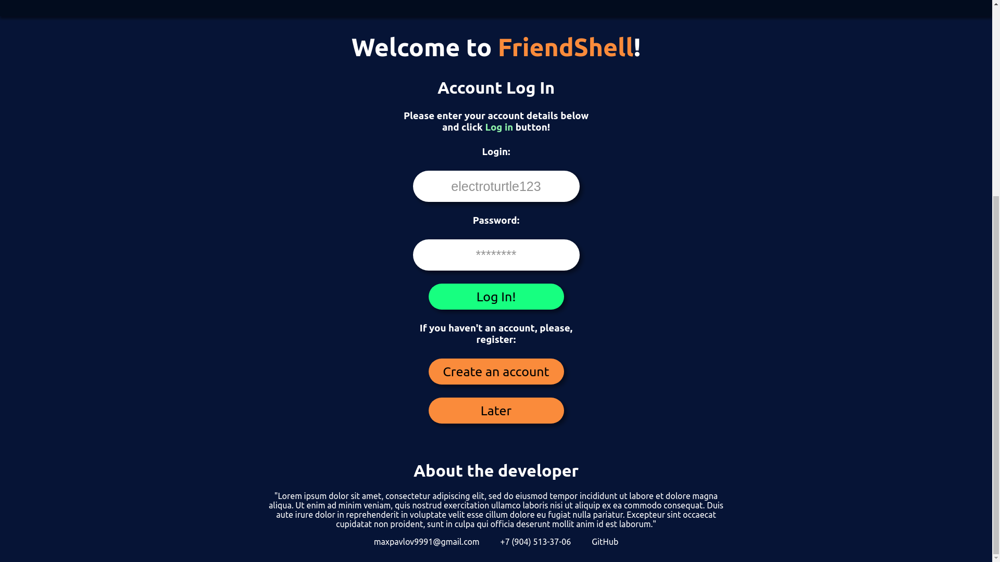
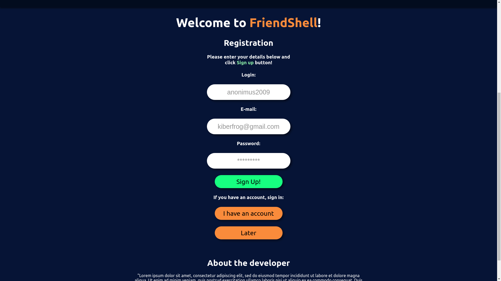

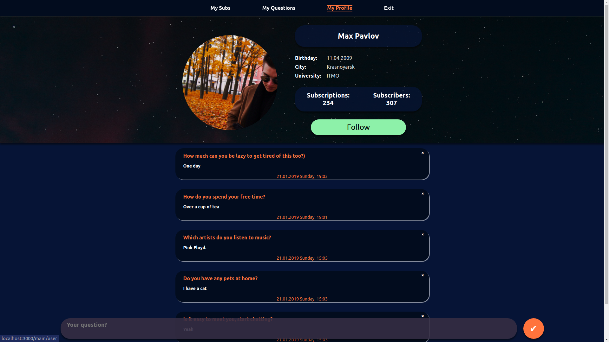
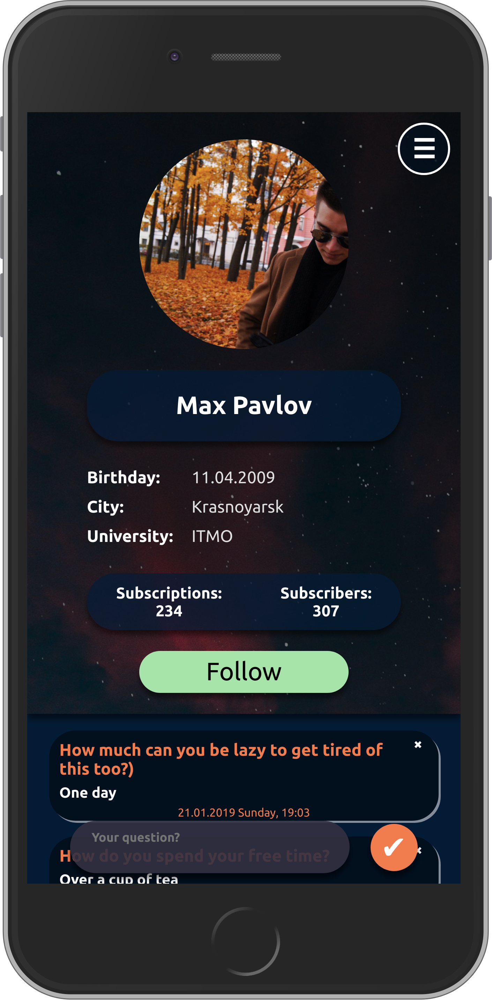

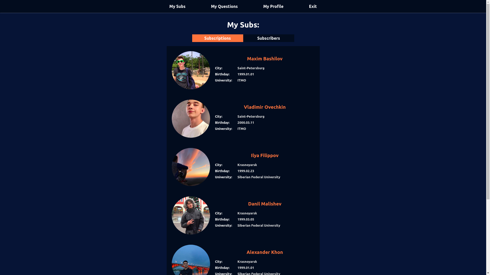
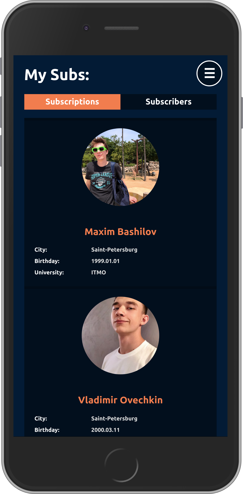

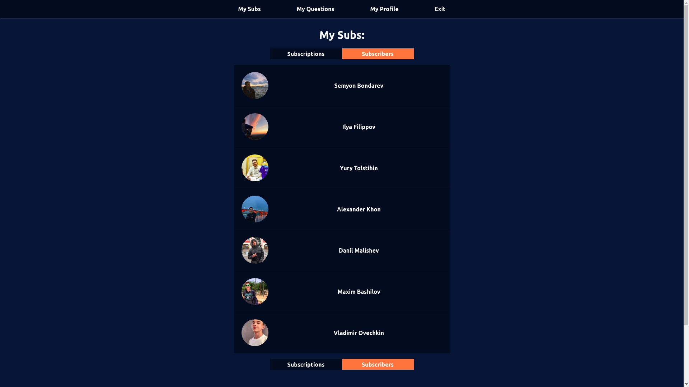
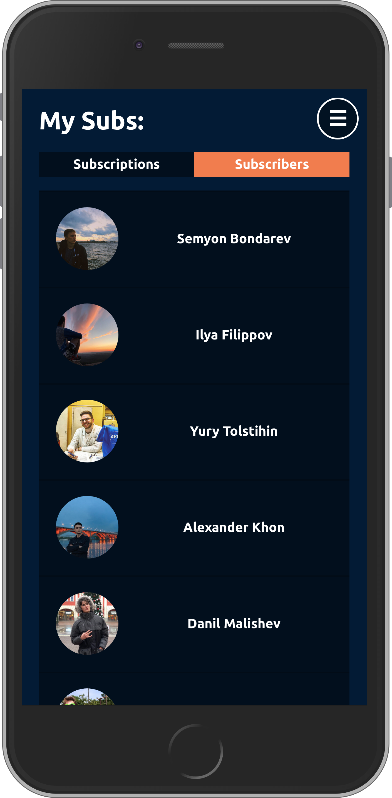

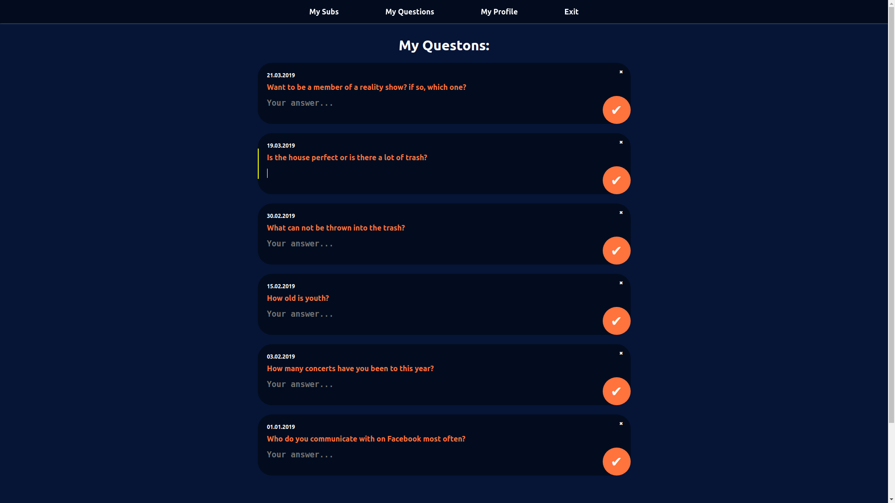
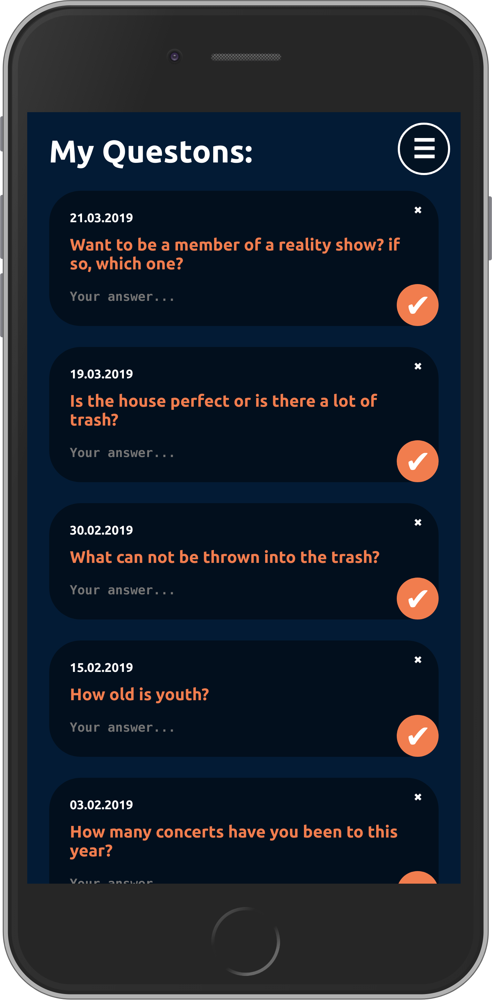